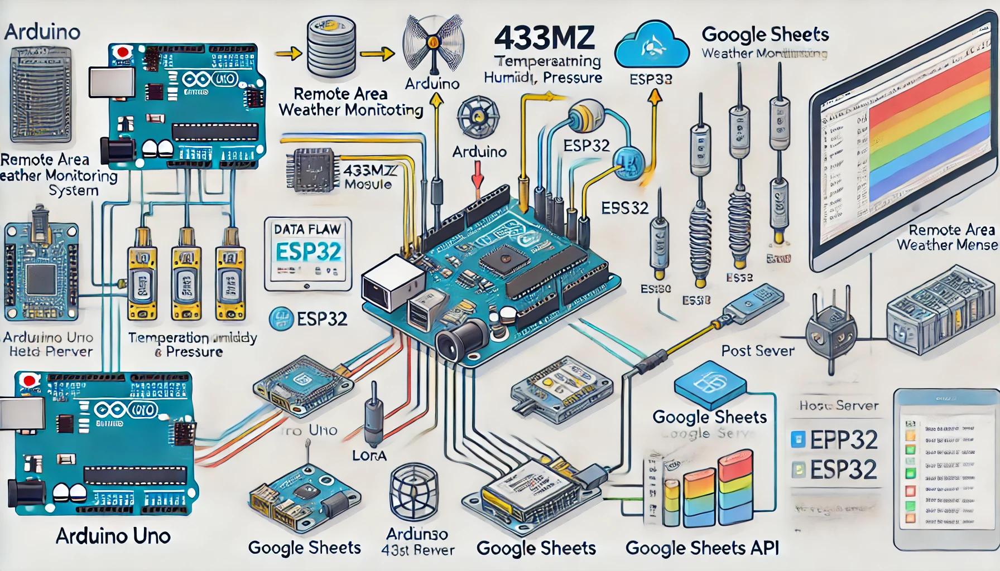
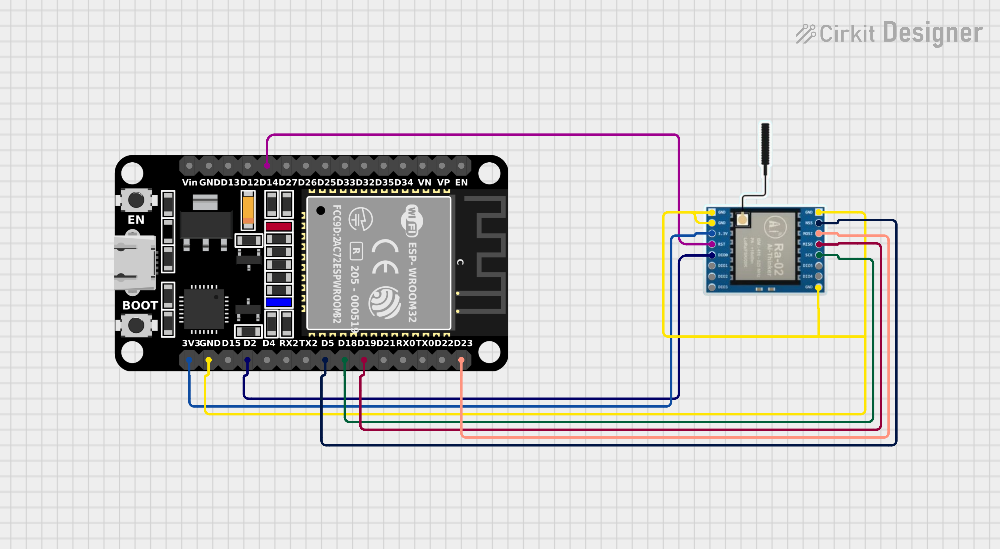
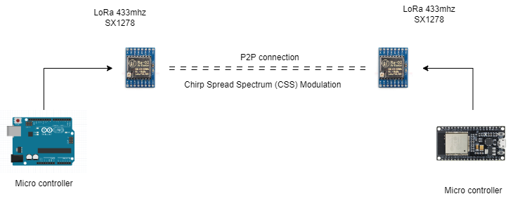

# Remote Area Weather Monitoring System

## Overview

This project provides real-time weather data from remote areas without relying on external weather monitoring systems. It focuses on detailed weather analysis at specific altitudes, utilizing the LoRa 433MHz module for communication.


*Basic understanding*

## Features

- **Real-Time Data Collection**: Monitors weather data such as temperature, humidity, pressure, and altitude.
- **Long-Range Communication**: Utilizes LoRa technology for data transmission up to 12 km without internet, cellular towers, or satellites.
- **Local Web Server**: Displays real-time weather data on a locally hosted web server using ESP32.
- **Data Storage**: Automatically saves collected data to Google Sheets for easy access and historical tracking.
- **Data Visualization**: Allows users to view and analyze weather data via a user-friendly web interface.
- **Future Scope**: Potential for machine learning integration for weather forecasting and solar power utilization for system sustainability.

## System Architecture

### Components Used

- **Arduino Uno**: Collects weather data from sensors.
- **LoRa 433MHz Module**: Facilitates long-range communication.
- **ESP32**: Hosts a local web server and processes data.
- **Google Sheets**: Stores data for further analysis.

### Data Flow

1. **Data Collection**: Arduino Uno collects weather data from sensors.
2. **Data Transmission**: Data is transmitted via the LoRa module to the ESP32.
3. **Data Storage**: ESP32 sends data to Google Sheets using an HTTPS POST request.
4. **Data Retrieval**: Data is fetched from Google Sheets using the SheetDB API for display on the website.
5. **Data Processing**: Data can be analyzed locally or in the cloud using the Pandas library.

[See Live here from the google sheet database](https://final-year-project-website-r4pfuwje3-babanroys-projects.vercel.app/)
*realtime visulization for the website*

## Setup Instructions

### Required Components

- Arduino Uno
- LoRa 433MHz Module
- ESP32
- Weather sensors (e.g., temperature, humidity, pressure sensors)
- Jumper wires and breadboard

## Installation Steps

1. **Hardware Setup**:
   - Connect the LoRa module to the Arduino Uno.
   - Connect sensors to the Arduino Uno.
   - Set up the ESP32 for hosting a web server.

### Sending part

*ArduinoUno connection with other components*

### Receiving part

*ESP32 connection with other components*

2. **Software Installation**:
   - Install the Arduino IDE.
   - Install necessary libraries (LoRa, ESP32 Web Server, etc.).

3. **Upload Code**:
   - Upload the Arduino sketch to the Arduino Uno.
   - Set up the ESP32 to receive data and host the web server.

4. **Google Sheets Setup**:
   - Create a Google Sheet to store the weather data.
   - Set up Google Apps Script for the webhook service.
   - Deploy the script as a web app.

5. **Access the Web Interface**:
   - Open the web browser and access the local server address to view real-time weather data.

### LoRa working

*pear to pear connection*

## Data Processing and Visualization

- Data can be fetched from Google Sheets using the Sheet ID.
- Use the Pandas library for data processing and visualization.

### Sample Code for Data Processing

```python
import pandas as pd

# Fetch data from Google Sheets
sheet_id = 'your_google_sheet_id'
data_url = f'https://docs.google.com/spreadsheets/d/{sheet_id}/gviz/tq?tqx=out:csv'
data = pd.read_csv(data_url)

# Data analysis and plotting
print(data.head())
data.plot(x='Date', y=['Temperature', 'Humidity'], kind='line')
```

Future Scope
Machine Learning: Implement machine learning algorithms for weather forecasting.
Solar Power: Integrate solar panels to power the monitoring modules for increased sustainability.
Screenshots
Data Collection Interface:Show Image
Web Server Display:Show Image
Google Sheets Data:Show Image
Conclusion
This weather monitoring system is a comprehensive solution for tracking weather data in remote areas. With the ability to store and analyze data online, it offers valuable insights into weather patterns and potential applications for future forecasting.
